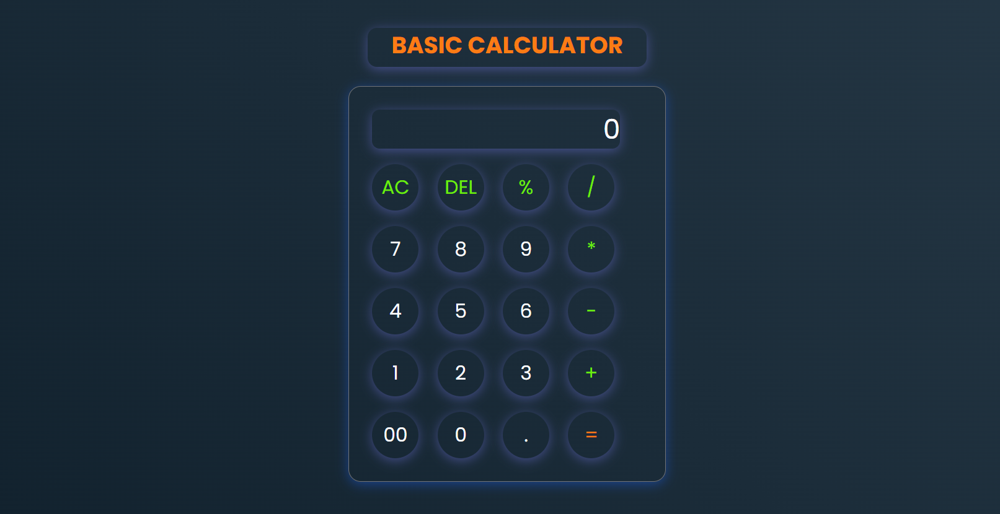

# Basic Calculator App (HTML, CSS, JavaScript)
This is a simple yet functional calculator app built using HTML, CSS, and JavaScript. The calculator performs basic arithmetic operations such as addition, subtraction, multiplication, and division. It provides an intuitive and easy-to-use interface, styled with modern CSS, and allows users to input numbers and perform calculations directly in their browser.

🚀 View Live - [View Live](https://vssaurabh10.github.io/Basic-Calculator-App/)

## Screenshot

## Features:
- Basic arithmetic operations: Addition (+), Subtraction (-), Multiplication (×), and Division (÷)
- Clean and minimalistic user interface
- Interactive buttons with responsive design
- Real-time calculation display as numbers are input
- Built with vanilla JavaScript for functionality
- This project provides me perfect as a beginners looking to understand the integration of HTML, CSS, and JavaScript in a small-scale web application.

